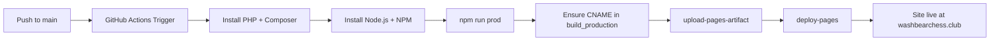

# Design Document: GitHub Pages CI/CD

## Overview

Replace the manual build-and-deploy workflow with a single GitHub Actions workflow file that triggers on push to `main`. The workflow builds the Jigsaw static site in CI and deploys it to GitHub Pages using the official artifact-based deployment method (`actions/upload-pages-artifact` + `actions/deploy-pages`). This eliminates the need for timestamped `gh-pages-*` branches, manual subtree pushes, and manual Pages settings changes.

The artifact-based approach is the recommended GitHub Pages deployment method. Instead of pushing built files to a branch, the workflow uploads the build output as an artifact and deploys it directly through the GitHub Pages API. This sidesteps the stale-refs problem entirely since no deployment branch is involved.

## Architecture

The solution is a single YAML workflow file at `.github/workflows/deploy.yml`. No application code changes are needed beyond ensuring the CNAME file ends up in `build_production`.

The workflow has two jobs:

1. **build** — Sets up PHP and Node.js, installs dependencies, runs the production build, validates the CNAME file exists, and uploads `build_production` as a Pages artifact.
2. **deploy** — Uses `actions/deploy-pages` to publish the uploaded artifact to GitHub Pages.

## Components and Interfaces

### Workflow File: `.github/workflows/deploy.yml`

The only new file. Contains:

- **Trigger**: `on: push` to `main` branch
- **Permissions**: `pages: write`, `id-token: write` (required by deploy-pages), `contents: read`
- **Concurrency**: `github.ref` based concurrency group to prevent overlapping deploys
- **Environment**: `github-pages` environment with the deployment URL

### Build Job

| Step | Action/Command | Purpose |
|------|---------------|---------|
| Checkout | `actions/checkout@v4` | Clone the repo |
| Setup PHP | `shivammathur/setup-php@v2` | Install PHP 8.2 (compatible with Jigsaw 1.7) |
| Composer cache | `actions/cache@v4` | Cache `vendor/` keyed on `composer.lock` |
| Composer install | `composer install --no-dev --prefer-dist` | Install PHP deps |
| Setup Node | `actions/setup-node@v4` with `node-version-file: '.nvmrc'` | Install Node 22 per `.nvmrc` |
| NPM cache | Built-in `cache: 'npm'` on setup-node | Cache `node_modules/` |
| NPM install | `npm ci` | Install Node deps |
| Build | `npm run prod` | Run Laravel Mix + Jigsaw production build |
| CNAME | Copy/verify CNAME into `build_production/` | Ensure custom domain persists |
| Upload | `actions/upload-pages-artifact@v3` with `path: build_production` | Package build for Pages |

### Deploy Job

| Step | Action | Purpose |
|------|--------|---------|
| Deploy | `actions/deploy-pages@v4` | Publish artifact to GitHub Pages |

### One-Time Manual Setup

The repo owner must change the GitHub Pages source from "Deploy from a branch" to "GitHub Actions" in the repository's Pages settings. This is a one-time change. After that, all deployments are fully automated.

## Data Models

No data models are involved. The workflow operates on files (source code in, static HTML out) and uses GitHub's Pages API for deployment. The only persistent data artifact is the CNAME file containing `washbearchess.club`.

### CNAME Handling Strategy

The CNAME file currently exists at the repo root. The Jigsaw build process copies files from `source/` into `build_production/`. To ensure the CNAME file is always present in the build output, the workflow includes an explicit step that copies the root `CNAME` file into `build_production/CNAME` if it is not already there, then validates its presence before uploading.

## Correctness Properties

*A property is a characteristic or behavior that should hold true across all valid executions of a system — essentially, a formal statement about what the system should do. Properties serve as the bridge between human-readable specifications and machine-verifiable correctness guarantees.*

### Analysis

This feature's deliverable is a single GitHub Actions workflow YAML file. The "inputs" to this system are not programmatic data but rather git pushes, and the "outputs" are deployments managed by GitHub's infrastructure. The acceptance criteria are structural constraints on the workflow configuration rather than behavioral properties over varying inputs.

After analyzing all acceptance criteria:

- Requirements 1.1–1.4 describe CI environment setup and error handling, which are inherent to GitHub Actions and not testable as properties.
- Requirements 2.1–2.4, 3.1–3.3, 4.1–4.3 are structural constraints on the YAML file — verifiable as specific examples but not as universally quantified properties over random inputs.
- Requirement 4.4 is a documentation/design concern.

Because the deliverable is a static configuration file (not a function processing inputs), there are no universally quantified properties suitable for property-based testing. Correctness is best validated through:
1. Structural example tests that parse the YAML and verify expected keys, actions, and values exist.
2. Actually running the workflow on GitHub (integration testing via a real push).

No property-based tests are applicable for this feature.

## Error Handling

| Scenario | Handling |
|----------|----------|
| Composer install fails | Job fails, GitHub Actions reports error in the Actions tab |
| NPM install fails | Job fails, GitHub Actions reports error in the Actions tab |
| `npm run prod` fails | Job fails, build output not uploaded |
| CNAME missing from build_production | Explicit validation step fails the job with a descriptive error message |
| Pages deployment fails | `deploy-pages` action reports failure; can be retried by re-running the workflow |
| Concurrent pushes | Concurrency group cancels in-progress deploys, only latest push deploys |

## Testing Strategy

Since this feature produces a GitHub Actions workflow file (infrastructure configuration), the testing approach differs from typical application code:

### Validation Approach

1. **YAML Linting**: Validate the workflow file is syntactically correct YAML and conforms to GitHub Actions schema.
2. **Structural Verification**: Example-based tests that parse the YAML and confirm:
   - The trigger is configured for pushes to `main`
   - The build job contains PHP setup, Node setup, Composer install, NPM install, and build steps
   - The deploy job uses `actions/deploy-pages`
   - The CNAME validation step exists
   - Caching is configured for both Composer and NPM
   - The `upload-pages-artifact` path points to `build_production`
3. **Manual Integration Test**: After merging the workflow, push a commit to `main` and verify the site deploys successfully to `washbearchess.club`.

### Testing Tools

- **actionlint**: GitHub Actions workflow linter (can be run locally)
- Manual verification via GitHub Actions UI after first deployment

### No Property-Based Tests

Property-based testing is not applicable here. The deliverable is a declarative YAML configuration, not a function with varying inputs. The workflow's correctness is validated by structural checks and by running it on GitHub's infrastructure.
